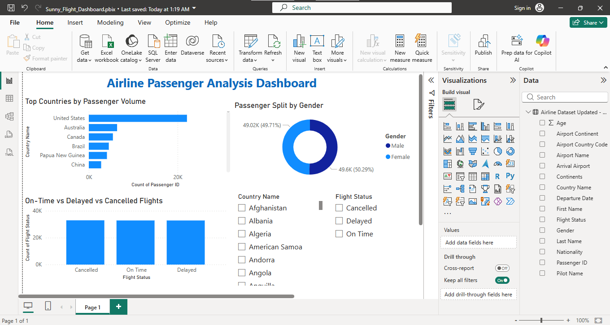
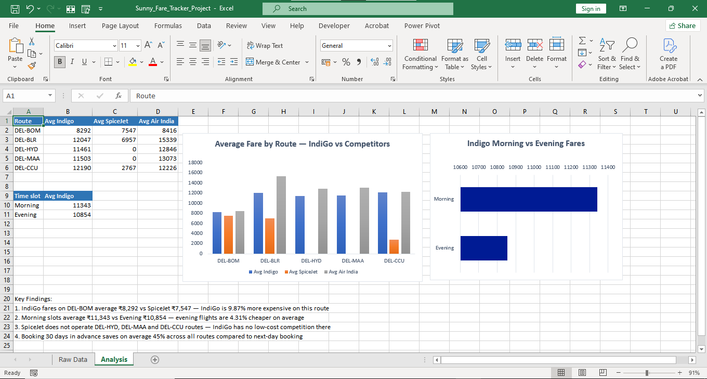
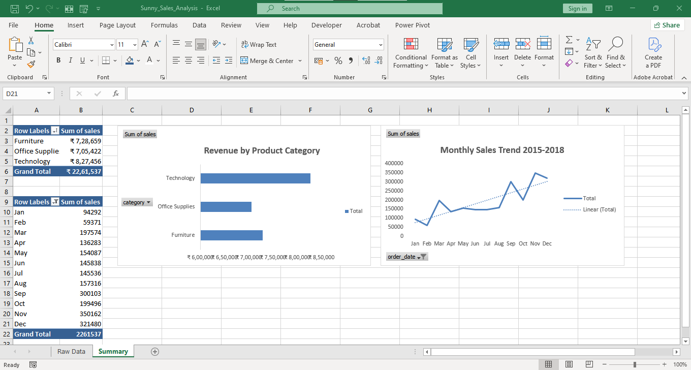

# Data Analytics Portfolio

Three self-built projects using Excel, Python (Pandas) and Power BI on real datasets.

## 1. Flight Dashboard (Power BI)

Interactive dashboard on 98,000+ airline passenger records: top countries by passenger volume, gender split, and on-time vs delayed vs cancelled flights, with Country and Flight Status slicers.

## 2. Competitor Fare Tracker (Excel)

Tracked IndiGo, SpiceJet and Air India fares on 5 Delhi-origin routes across 3 booking windows. Found that booking 30 days early saves about 45% on average, and evening flights average 4.31% cheaper than morning flights.

## 3. Sales Data Cleaning and Analysis (Python + Excel)

Cleaned a 9,800-row retail dataset with Pandas (nulls, duplicates, column names), then built pivot tables and charts. Technology was the top revenue category, with a clear upward trend and Q4 peaks each year.

Tools: Excel, Power BI, SQL, Python (Pandas)
